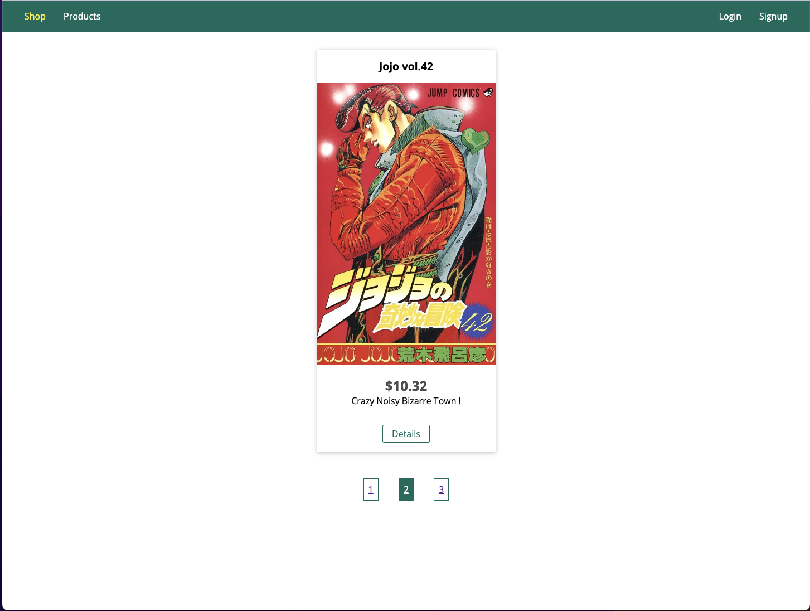

# Node.js Shop Application

A Node.js shop application featuring user authentication, product management, order processing, and integration with SQL and NoSQL databases, demonstrating practical RESTful API implementation.

## Fundamentals

- **Lifecycle & Event Loop**: Basics of Node.js lifecycle and asynchronous operations.
- **Core Modules & Module System**: Using Node.js built-in modules and managing dependencies.
- **Nodemon & Debugging**: Autorestarts and debugging techniques.

## Express.js

- **Middleware & Routing**: Handling requests and responses, setting up routes.
- **Serving Files**: Deliver static content efficiently.

## Templating Engines

- **Pug / Handlebars / EJS**: Using different templating engines.
- **Dynamic Content & Partials**: Creating dynamic web pages and reusable template parts.

## MVC Pattern

- **Model-View-Controller**: Structuring applications with MVC for better organization.

## Dynamic Routes & Models

- **Dynamic Routing**: Using path and query parameters.
- **Advanced Models**: Managing relationships between data models.

## SQL Introduction

- **SQL vs. NoSQL**: Differences and use cases.
- **Database Operations**: Connecting, fetching, and inserting data.

## Sequelize

- **Abstraction & Migrations**: Simplifying database operations with Sequelize.

## NoSQL with MongoDB

- **Flexible Schemas**: Working with MongoDB for schema-less design.

## Mongoose

- **Schema Modeling & Queries**: Defining schemas and building queries with Mongoose.

## Sessions & Cookies

- **Session Management**: Handling sessions and cookies for user state.

## Authentication

- **User Authentication**: Implementing login, logout, and route protection.

## Advanced Authentication

- **Nodemailer & Password Reset**: Sending emails and handling password resets.
- **Authorization**: Managing user permissions.

## Validation

- **Input Validation & Sanitization**: Ensuring data integrity with express-validator.

## Error Handling

- **Middleware & Status Codes**: Managing errors and appropriate status codes.

## File Handling

- **Upload & Download**: Handling file uploads with Multer and generating PDFs.

## Pagination

- **Dynamic Links**: Implementing pagination for large datasets.

## Async Requests

- **Client-Side JS**: Managing background requests with JavaScript.
